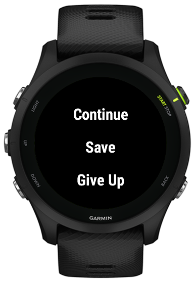
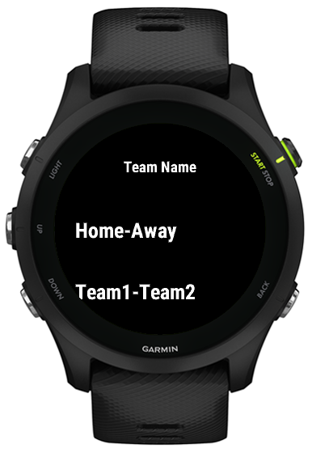
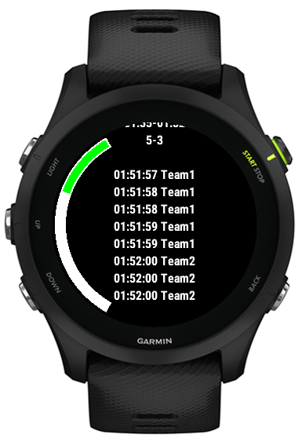
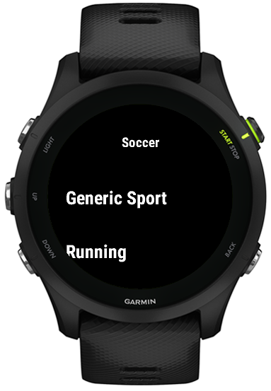

# Soccer Score
---

## ConnectIQ Store

[Goal Record](https://apps.garmin.com/en-US/apps/b4cb31e3-5b7e-4dfb-ad66-e21d747575ba)

## Short Story 小故事

I bought the Garmin Forerunner 255 to record my football data, but the original app doesn't support recording the time of goals and the teams.

I looked into it and realized I can develop an app to meet my needs.

我为了记录踢球数据，买了佳明 Forerunner 255，原始的 App 不支持记录进球的时间和球队。

我查看了一下，可以自己开发我需要的 App。

## Main features:

### 2024/10/17 v1.0

1. User prompts
2. Record the teams and times of goals
3. View reports (currently can be optimized using ViewLoop)
4. Delete data (can implement individual deletion)

The basic features have been implemented. 

### 2024/10/21 v1.1

1. Show speed or start time
2. Change team name

### 2024/10/21 v1.2

1. Page Report(LoopView)
2. Change team name success

### 2024/10/24 v1.3

1. More wear devices

### 2024/10/26 v1.4

1. Types of sport

### 2024/11/04 v1.5

1. Internationalization

缩写	| 中文 |	英文
---|---|---
ara	| 阿拉伯语	| Arabic
bul	| 保加利亚语	| Bulgarian
ces	| 捷克语	| Czech
dan	| 丹麦语	| Danish
deu	| 德语	| German
dut	| 荷兰语	| Dutch
eng	| 英语	| English
est	| 爱沙尼亚语	| Estonian
fin	| 芬兰语	| Finnish
fre	| 法语	| French
gre	| 希腊语	| Greek
heb	| 希伯来语	| Hebrew
hrv	| 克罗地亚语	| Croatian
hun	| 匈牙利语	| Hungarian
ind	| 印尼语	| Indonesian
ita	| 意大利语	| Italian
jpn	| 日语	| Japanese
kor	| 韩语	| Korean
lav	| 拉脱维亚语	| Latvian
lit	| 立陶宛语	| Lithuanian
nob	| 挪威语	| Norwegian
pol	| 波兰语	| Polish
por	| 葡萄牙语	| Portuguese
ron	| 罗马尼亚语	| Romanian
rus	| 俄语	| Russian
slo	| 斯洛伐克语	| Slovak
slv	| 斯洛文尼亚语	| Slovenian
spa	| 西班牙语	| Spanish
swe	| 瑞典语	| Swedish
tha	| 泰语	| Thai
tur	| 土耳其语	| Turkish
ukr	| 乌克兰语	| Ukrainian
vie	| 越南语	| Vietnamese
zhs	| 简体中文	| Simplified Chinese
zht	| 繁体中文	| Traditional Chinese
zsm	| 马来语	| Malay

## Screenshots

