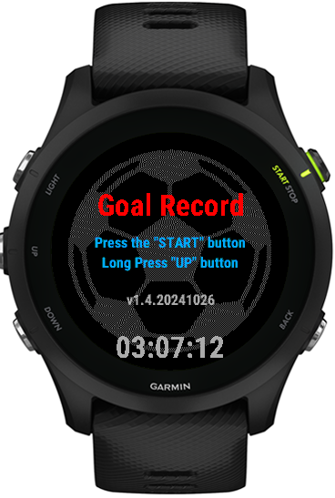
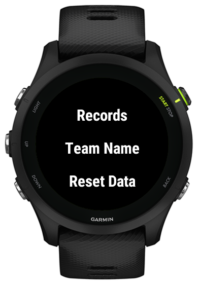

# Soccer Score
---

## ConnectIQ Store

[Goal Record](https://apps.garmin.com/en-US/apps/b4cb31e3-5b7e-4dfb-ad66-e21d747575ba)

## Short Story 小故事

I bought the Garmin Forerunner 255 to record my football data, but the original app doesn't support recording the time of goals and the teams.

I looked into it and realized I can develop an app to meet my needs.

Main features:
1. User prompts
2. Record the teams and times of goals
3. View reports (currently can be optimized using ViewLoop)
4. Delete data (can implement individual deletion)

The basic features have been implemented. 

#3 can be optimized using ViewLoop.

and #4 can be implemented for individual deletion.

I currently do not plan to continue the development, so I will open source it for everyone to reference.

我为了记录踢球数据，买了佳明 Forerunner 255，原始的 App 不支持记录进球的时间和球队。
我查看了一下，可以自己开发我需要的 App。

主要功能：
1. 用户提示
2. 记录进球的球队和时间
3. 可以查看报表
4. 可以删除数据

基本功能已经实现，#3 可以优化成使用 ViewLoop，#4 可以实现单独删除。

目前不打算继续开发了，开源出来供大家参考。

## Screenshots

